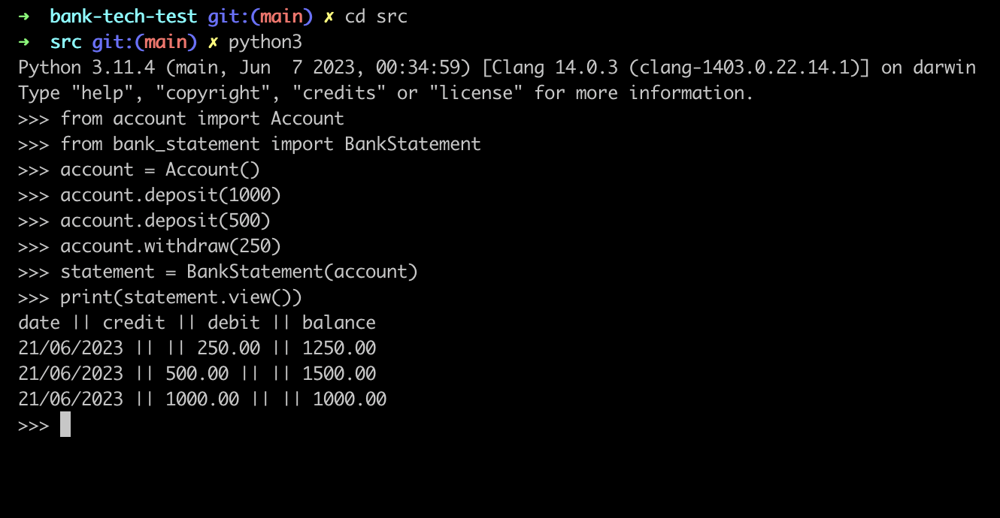

# Bank Mock Tech Test

## Overview
This is my completed 'bank' tech test for Makers Academy. It is a simple program which allows users to deposit and withdraw from a bank account in their command line and then view a statement based on these transactions in the following format
```
date || credit || debit || balance
14/01/2023 || || 500.00 || 2500.00
13/01/2023 || 2000.00 || || 3000.00
10/01/2023 || 1000.00 || || 1000.00
```

## Approach
I decided to implement this in Python since I wanted an extra challenge and to get some exposure to another language. I used the unittest library to test drive this project.
Each class was designed sequentially:

**Transaction**
which creates transaction objects which contain the date it was made and the monetary value of the transaction.

**Account**
which creates a blank account with an initial balance of 0 and an array which will be populated with logs of transaction, storing the transaction object and the current balance after that transaction is added.

**BankStatement**
which is initialised with an account object and will create a statement for the account up to that point.

Here is an initial design diagram which demonstrates the structure described above:
<br>
<br>

<br>
<br>

## Running the program
With python3 installed, clone this repository and install the dependencies:

```
git clone https://github.com/lplclaremont/bank-tech-test
cd bank-tech-test
pip3 install -r requirements.txt
```

Open the REPL inside the src folder and import the relevant classes:

```
cd src
python3
>>> from account import Account
>>> from bank_statement import BankStatement
```

Now you are able to make deposits and withdrawals like so:

```
>>> account = Account()
>>> account.deposit(1000)
>>> account.deposit(500)
>>> account.withdraw(250)
```

And view your statement:

```
>>> statement = BankStatement(account)
>>> print(statement.view())
```
Here is an example output:
<br>
<br>

<br>
<br>


## Running the tests
The tests utilise Python's standard unittest library.
Run the following command inside the bank-tech-test directory:
```
python3 -m unittest discover -s tests -p '*_test.py'
```

Here is the test coverage report:
<br>
<br>

<br>
<br>
